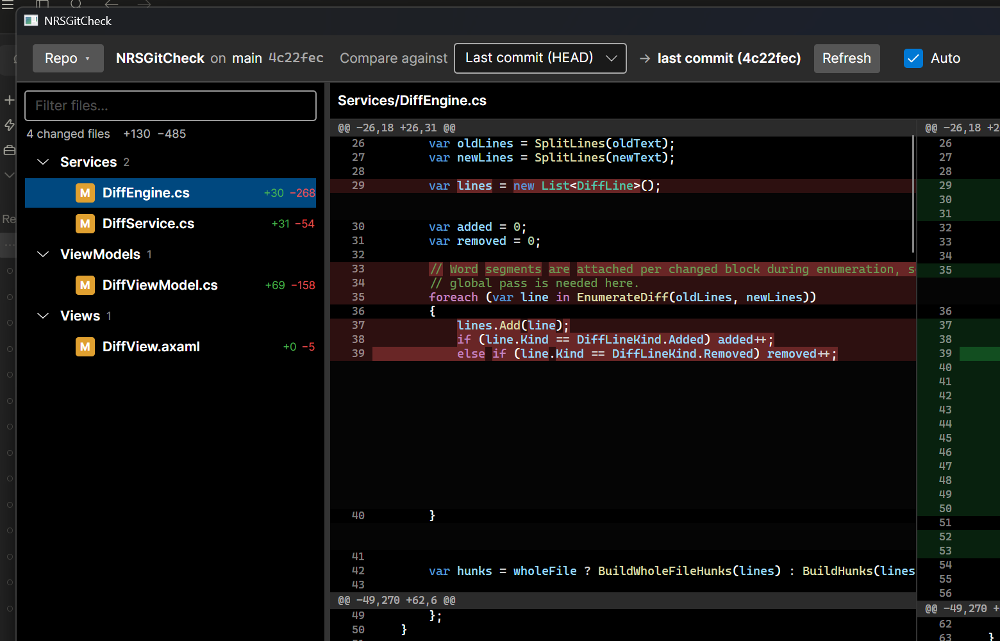
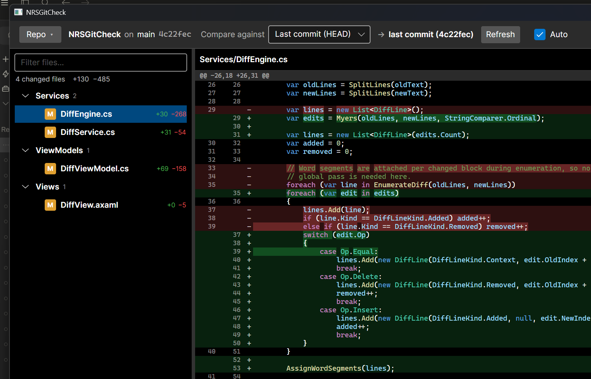
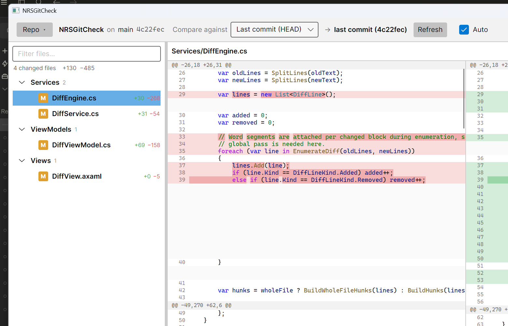
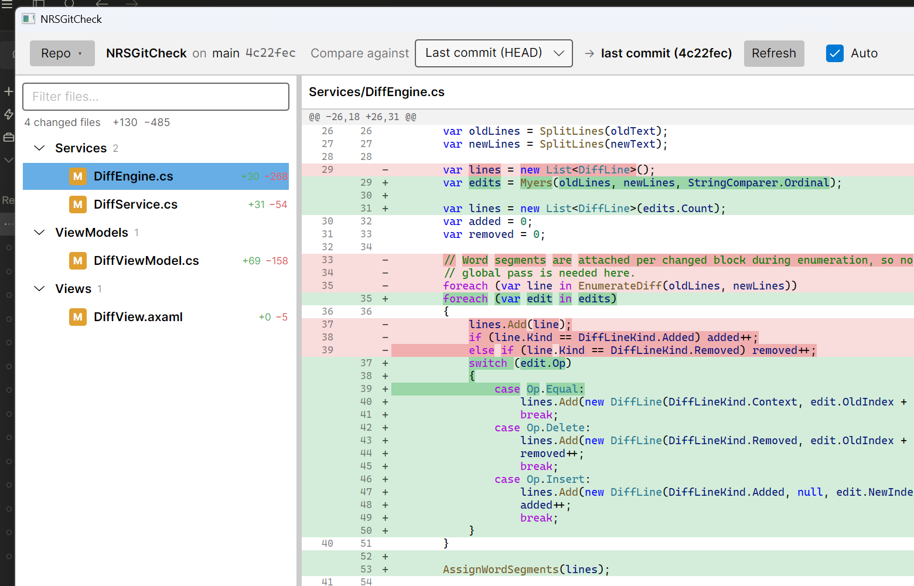

# NRSGitCheck

A fast, **read-only** desktop viewer for your Git changes. Open a repository, pick what
to compare against, and browse the diff with syntax highlighting, word-level change
emphasis, side-by-side or inline layouts, and progressive rendering that stays smooth
even on very large files.

NRSGitCheck never writes to your repository — it only reads, so it's safe to point at
any working tree.



## Features

- **Compare against anything** — your last commit (`HEAD`), another local branch, or the
  merge-base with a parent branch.
- **Side-by-side and inline diffs** — toggle layouts instantly. Side-by-side panes are
  equal-width, each with their own horizontal scrollbar, and scroll in sync.
- **Syntax highlighting** for the diffed file (TextMate grammars), layered with
  **word-level** add/remove emphasis on modified lines.
- **Whole-file or hunks** — view just the changed regions with context, or the entire
  file with the diff highlighting intact.
- **Changed-files tree** with a live filter and per-file `+`/`−` line counts.
- **Progressive rendering** — large diffs stream in hunk-by-hunk so the top of a file is
  visible while the rest is still being computed (see [How it works](#how-it-works)).
- **Auto-refresh** — optionally poll the repository on an interval and update the change
  list when something new appears, without disturbing your current view.
- **Keyboard-driven** navigation between files and hunks, plus a help overlay.
- **Light / dark / system** theming, and it reopens your last repository on launch.

## Screenshots

**Dark theme**

| Side-by-side | Inline (unified) |
| --- | --- |
|  |  |

**Light theme**

| Side-by-side | Inline (unified) |
| --- | --- |
|  |  |

## Getting started

### Prerequisites

- [.NET 10 SDK](https://dotnet.microsoft.com/download)
- Windows (the app is built as a Windows desktop app; the underlying
  [Avalonia](https://avaloniaui.net/) UI toolkit is cross-platform)

### Build & run

```bash
# from the repository root
dotnet run --project NRSGitCheck.csproj
```

To produce a build without running:

```bash
dotnet build -c Release
```

### Run the tests

```bash
dotnet test
```

## Usage

1. **Open a repository** with the *Repo* button (or `Ctrl+O`). Recently opened repos are
   remembered and shown as quick-pick pills.
2. Choose a **comparison target** from the *Compare against* dropdown:
   - **Last commit (HEAD)** — your uncommitted working-tree changes.
   - **Another branch** — diff against the tip of a chosen local branch.
   - **Branch base (merge-base)** — diff against where your branch diverged from a parent.
3. Pick a file in the tree to see its diff. Use the header buttons to switch between
   **inline / side-by-side** and to toggle **whole file** vs. changed regions.
4. Tick **Auto** to have the change list refresh itself periodically.

### Keyboard shortcuts

| Action | Keys |
| --- | --- |
| Next change / hunk | `J` · `Alt+↓` |
| Previous change / hunk | `K` · `Alt+↑` |
| Next file | `Ctrl+↓` · `]` |
| Previous file | `Ctrl+↑` · `[` |
| Toggle diff layout | `Ctrl+L` |
| Toggle theme | `Ctrl+T` |
| Open repository | `Ctrl+O` |
| Refresh changes | `F5` |
| Focus file filter | `Ctrl+F` |
| Show shortcuts | `?` · `F1` |

## How it works

The diff engine is a pure, UI-free Myers shortest-edit-script implementation. For speed
on large files it first trims the common prefix/suffix and splits the file on
**patience-style anchors** (lines that occur exactly once on each side), then runs Myers
only on the small regions between anchors. Hunks are produced **lazily** and streamed to
the UI, so rendering of the first hunks overlaps with computation of the rest — the diff
appears progressively rather than freezing until it's done. Word-level highlighting and
syntax colors are applied per hunk as it arrives.

## Tech stack

- [.NET 10](https://dotnet.microsoft.com/) / C#
- [Avalonia](https://avaloniaui.net/) — cross-platform UI
- [LibGit2Sharp](https://github.com/libgit2/libgit2sharp) — read-only Git access
- [TextMateSharp](https://github.com/danipen/TextMateSharp) — syntax highlighting
- [CommunityToolkit.Mvvm](https://learn.microsoft.com/dotnet/communitytoolkit/mvvm/) — MVVM
- xUnit for tests

## Project layout

```
Models/        Domain types (diff documents, file changes, settings)
Services/      Git access, diff engine, syntax highlighting, settings, theming
ViewModels/    MVVM view models for the window and the diff view
Views/         Avalonia XAML views and code-behind
Converters/    Value converters for diff rendering
NRSGitCheck.Tests/  xUnit test suite
```

## License

Released under the [MIT License](LICENSE) — you're free to use, modify, and distribute
it for pretty much anything, including commercial use. See the [LICENSE](LICENSE) file
for details.
